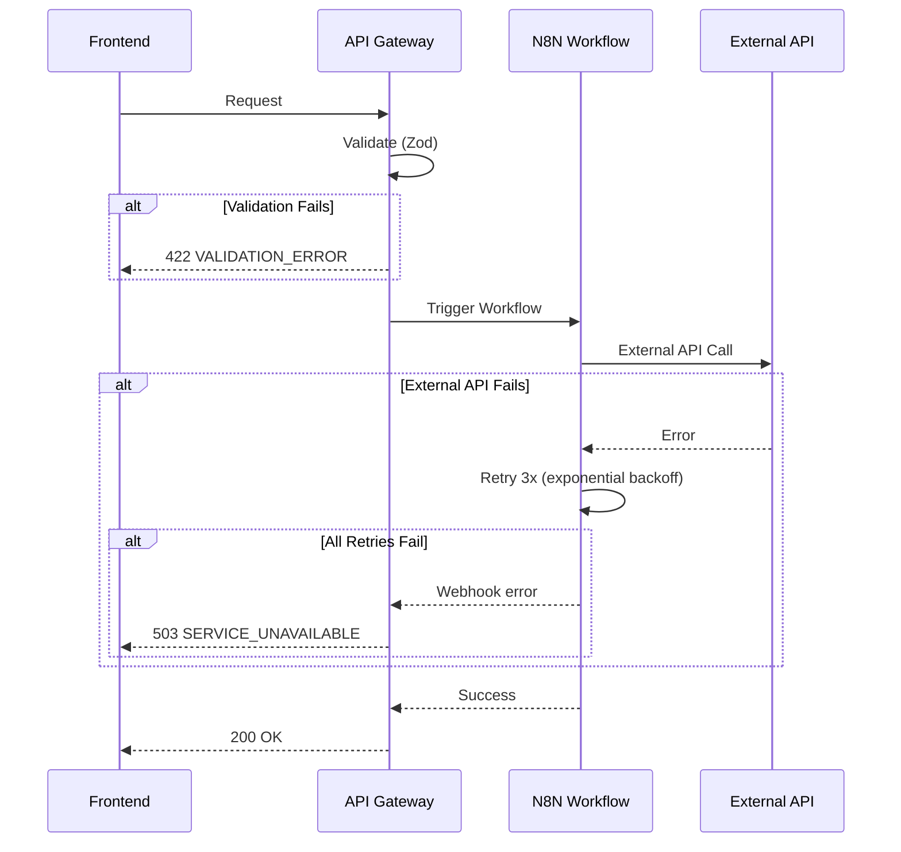

# Error Handling Strategy

## Error Flow



## Error Response Format

```typescript
interface ApiError {
  error: {
    code: string;              // INVALID_REQUEST, UNAUTHORIZED, etc.
    message: string;           // Human-readable error
    details?: Record<string, any>;  // Field-level validation errors
    timestamp: string;         // ISO 8601
    requestId: string;         // For debugging
  };
}
```

## Frontend Error Handling

```typescript
// lib/api-client.ts
api.interceptors.response.use(
  (response) => response,
  (error) => {
    if (error.response?.status === 401) {
      // Unauthorized - logout
      useAuthStore.getState().logout();
      window.location.href = '/login';
    } else if (error.response?.status >= 500) {
      // Server error - show toast
      toast.error('Something went wrong. Please try again.');
      // Log to Sentry
      Sentry.captureException(error);
    }
    return Promise.reject(error);
  }
);
```

## Backend Error Handling

```typescript
// middleware/error-handler.middleware.ts
export function errorHandler(error: Error, request: FastifyRequest, reply: FastifyReply) {
  const requestId = request.id;

  // Log to Better Stack
  logger.error({ error, requestId, url: request.url });

  // Log to Sentry
  Sentry.captureException(error, { extra: { requestId, url: request.url } });

  // Respond to client
  if (error instanceof ZodError) {
    return reply.status(422).send({
      error: {
        code: 'VALIDATION_ERROR',
        message: 'Request validation failed',
        details: error.errors,
        timestamp: new Date().toISOString(),
        requestId,
      },
    });
  }

  // Generic 500 error
  return reply.status(500).send({
    error: {
      code: 'INTERNAL_SERVER_ERROR',
      message: 'An unexpected error occurred',
      timestamp: new Date().toISOString(),
      requestId,
    },
  });
}
```

---
