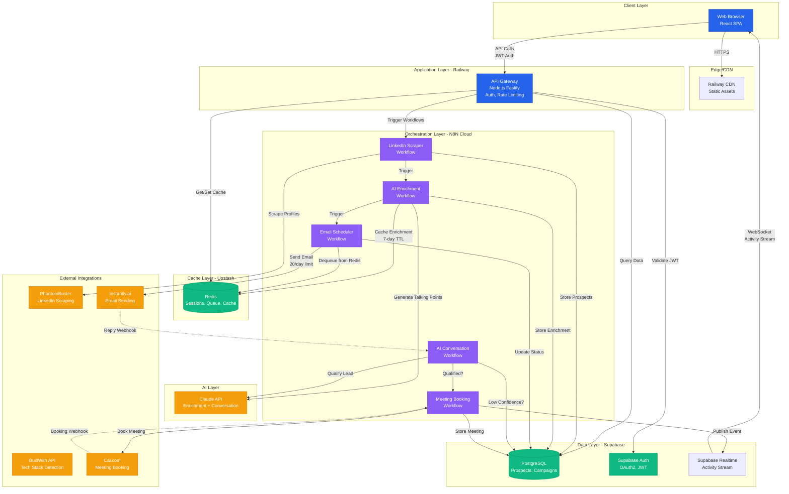

# High Level Architecture

## Technical Summary

Sales Machine is a hybrid microservices architecture combining **N8N workflows as orchestration engine**, **custom Node.js API Gateway**, **React SPA frontend**, and **Supabase PostgreSQL** with **Upstash Redis** for caching and queuing. The system leverages **Claude API** for AI-powered prospect enrichment and conversational qualification, while **MCP (Model Context Protocol) servers** provide an abstraction layer for third-party integrations (scraping, enrichment, outreach). Deployment spans **Railway (API Gateway + Frontend)**, **N8N Cloud (workflows)**, **Supabase Cloud (database + auth)**, and **Upstash (Redis)**. This architecture enables autonomous prospecting at scale while maintaining solo-preneur operational simplicity through managed services and visual workflow debugging.

The frontend provides a trust-oriented dashboard that hides technical complexity behind business-focused interfaces (Health Score, Meeting Pipeline, AI Review Queue). Backend workflows handle LinkedIn scraping → Claude enrichment → email queueing → AI response → meeting booking autonomously, with human-in-the-loop intervention for VIP accounts and low-confidence AI decisions. Architecture prioritizes deliverability protection (hard-coded 20 emails/day limit), GDPR compliance (Supabase RLS + audit logging), and cost efficiency (<€2K/month for 15 customers).

## Platform and Infrastructure Choice

**Platform:** Multi-Cloud Managed Services (Supabase + Railway + N8N Cloud + Upstash)

**Key Services:**
- **Compute:** Railway (API Gateway + Frontend hosting), N8N Cloud (workflow execution)
- **Database:** Supabase PostgreSQL 15+ (primary data store + Auth + Realtime)
- **Caching/Queue:** Upstash Redis Serverless (session tokens, enrichment cache, email queue)
- **AI:** Anthropic Claude API (Sonnet 3.5/4 for enrichment and conversation)
- **CDN:** Railway built-in edge network + Supabase CDN for static assets
- **Integrations:** PhantomBuster (LinkedIn scraping), Instantly.ai/Smartlead (email), Cal.com (calendar)

**Deployment Host and Regions:**
- **Primary Region:** EU West (Frankfurt/Paris) for GDPR compliance and French user latency
- **Supabase:** eu-west-1 (Ireland) - closest EU region available
- **Railway:** Europe deployment (Frankfurt)
- **N8N Cloud:** EU infrastructure (managed by N8N)
- **Upstash:** eu-west-1 (Ireland) for Redis

**Rationale:**
- **Managed Services Priority:** Solo-preneur operational model eliminates DevOps overhead (no Kubernetes, no server patching)
- **European Data Residency:** GDPR compliance + <50ms latency for French users
- **Vendor Diversity:** No single-vendor lock-in (Railway can swap to Render/Fly.io, Supabase to self-hosted PostgreSQL)
- **Cost Optimization:** Free tiers cover Micro-MVP (Supabase free tier, Upstash 10K commands/day, Railway $5/month starter)

**Trade-offs:**
- ✅ Zero DevOps burden, 99.9% managed SLA, instant scaling to 100 users
- ✅ Geographic compliance (EU data residency)
- ⚠️ Vendor switching cost moderate (1-2 weeks migration if needed)
- ⚠️ N8N Cloud performance ceiling at ~500 concurrent users (acceptable Phase 2 concern)

## Repository Structure

**Structure:** Monorepo with npm workspaces (lightweight, no Turborepo complexity needed for Micro-MVP)

**Package Organization:**

```
sales-machine/
├── package.json                  # Root workspace config
├── .github/workflows/            # CI/CD
│   ├── ci.yaml                   # Lint, test, type-check
│   └── deploy.yaml               # Railway deployment
├── packages/
│   ├── shared/                   # Shared TypeScript types, constants, utils
│   │   ├── src/
│   │   │   ├── types/            # Prospect, Message, Campaign interfaces
│   │   │   ├── constants/        # ICP defaults, template variables
│   │   │   └── utils/            # Validation helpers, formatters
│   │   ├── package.json
│   │   └── tsconfig.json
│   └── ui/                       # Shared UI components (future - defer to post-MVP)
├── apps/
│   ├── web/                      # React frontend (Vite + React + TypeScript)
│   │   ├── src/
│   │   │   ├── components/       # UI components (HealthScoreCard, PipelineKanban)
│   │   │   ├── pages/            # Dashboard, ReviewQueue, Onboarding
│   │   │   ├── lib/              # Supabase client, API client
│   │   │   ├── hooks/            # useAuth, useCampaign, useRealtimeActivity
│   │   │   └── stores/           # Zustand stores (auth, campaign, notifications)
│   │   ├── public/
│   │   ├── index.html
│   │   ├── vite.config.ts
│   │   └── package.json
│   └── api/                      # Node.js API Gateway (Fastify + TypeScript)
│       ├── src/
│       │   ├── routes/           # /onboarding, /campaigns, /prospects, /ai-review
│       │   ├── middleware/       # Auth (JWT), rate limiting, error handling
│       │   ├── services/         # N8N webhook triggers, Supabase queries
│       │   ├── utils/            # Logger, validators
│       │   └── server.ts         # Fastify app entry point
│       ├── tests/
│       └── package.json
├── workflows/                    # N8N workflow JSON exports + docs
│   ├── linkedin-scraper.json
│   ├── ai-enrichment.json
│   ├── email-scheduler.json
│   ├── ai-conversation.json
│   ├── meeting-booking.json
│   └── README.md                 # Workflow deployment guide
├── mcp-servers/                  # MCP abstraction layer (Phase 2 - Epic 4)
│   ├── scraping/
│   │   ├── phantombuster-adapter.ts
│   │   └── captaindata-adapter.ts
│   ├── enrichment/
│   │   ├── claude-adapter.ts
│   │   └── openai-adapter.ts
│   └── package.json
├── scripts/                      # Deployment, seed data, migrations
│   ├── deploy-workflows.sh       # Upload N8N JSONs to N8N Cloud
│   ├── seed-templates.ts         # Populate email_templates table
│   └── migrate-database.sh       # Supabase migration runner
├── docs/                         # Documentation
│   ├── prd.md
│   ├── design-specifications.md
│   ├── architecture.md           # This file
│   └── runbooks/                 # Operational guides
└── .env.example                  # Environment variables template
```

**Monorepo Tool:** npm workspaces (built-in, zero config)

**Rationale:**
- **Solo-preneur simplicity:** No Turborepo/Lerna overhead (save 4-6 hours setup)
- **Shared types:** `packages/shared` enables type-safe API contracts (frontend imports `Prospect` type from shared)
- **Atomic deploys:** Single commit affects both frontend + backend (Railway auto-deploys from main branch)
- **Future flexibility:** Can migrate to Turborepo if team grows beyond solo (add `turbo.json` in 1 hour)

**Trade-offs:**
- ✅ Zero monorepo tooling complexity, fast npm install (shared dependencies hoisted)
- ✅ Railway supports monorepo detection (auto-builds `apps/web` and `apps/api` separately)
- ⚠️ No built-in caching for repeated builds (acceptable - CI runs <3 min total)

## High Level Architecture Diagram



## Architectural Patterns

- **Hybrid Microservices via N8N Workflows** - Each N8N workflow operates as independent microservice with dedicated execution context, enabling parallel processing and isolated failure domains. _Rationale:_ Proven with 22 existing workflows, visual debugging accelerates solo-preneur troubleshooting vs. pure code.

- **API Gateway Pattern** - Lightweight Node.js layer centralizes authentication, rate limiting, and request validation before routing to N8N workflows or Supabase. _Rationale:_ Protects workflows from unauthenticated access, enforces business rules (e.g., prevent bypassing 20 email/day limit).

- **MCP Abstraction Layer (Epic 4)** - Category-based servers (Scraping MCP, Enrichment MCP, Outreach MCP) wrap third-party integrations with standard interfaces, enabling tool swapping without workflow rewrites. _Rationale:_ Vendor lock-in mitigation (swap PhantomBuster for Captain Data via config change).

- **CQRS-Lite for AI Review Queue** - Separate read model (optimized query joins for review queue UI) from write model (normalized Supabase tables). _Rationale:_ Complex review queue queries (prospect + enrichment + message + context) benefit from materialized view vs. N+1 queries.

- **Event-Driven Workflow Chaining** - N8N workflows trigger subsequent workflows via internal webhooks (scrape → enrich → email → AI response). _Rationale:_ Loose coupling enables independent scaling and retry logic per workflow stage.

- **Cache-Aside Pattern (Redis)** - Application checks Redis before querying Supabase/Claude, populates cache on miss with TTL. _Rationale:_ Reduce Claude API costs (€0.01-0.05/conversation) by caching enrichment data for 7 days.

- **Circuit Breaker for External APIs** - N8N workflows implement retry logic with exponential backoff; after 3 failures, mark service degraded and notify user. _Rationale:_ PhantomBuster/Instantly.ai outages shouldn't cascade to full system failure.

- **Repository Pattern for Data Access** - API Gateway uses service layer (`ProspectService`, `CampaignService`) abstracting Supabase queries. _Rationale:_ Enables future database migration without rewriting routes; testable business logic.

---
